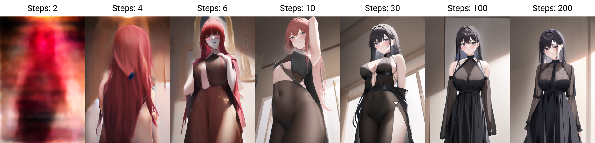
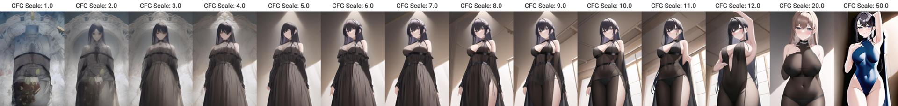

# 第一章 像素魔法的要素

### 像素魔法的常规要素

构建像素魔法通常会使用如下几大要素：

1. 正面咒语 <mark style="background-color:blue;">Prompt</mark>。控制魔法在哪些维度发挥作用。
2. 反面咒语 <mark style="background-color:blue;">Undesired Content（UC）</mark>。控制魔法，避免产生哪些效果。
3. 魔法规模 <mark style="background-color:blue;">Resolution</mark>。控制施法结果的尺寸。即使其他要素完全相同，但是魔法规模不同，施法结果是完全不同的，而非缩放和裁切的关系。在NovelAI中，首选512\*768规模的魔法。
4. 魔法基础模型 <mark style="background-color:blue;">model</mark>。基础模型决定了哪些咒语是有效的，产生的效果是如何的。在NovelAI中，目前基础模型有Curated，Full和Beta。
5. 魔法增补模型 <mark style="background-color:blue;">Hypernetwork</mark>。魔导士可以根据自己的需求，制作一个包含专有咒语的模型，作为基础模型的补充，和基础模型结合使用，从而获得个性化的魔法效果。
6. 魔力流转标尺 <mark style="background-color:blue;">Scale</mark>(CFG Scale)。魔法遵循咒语的程度，理论上值越高，法术效果越遵循咒语的指示；实际上可以一定程度控制施法结果的风格（而不是内容）。较低的值可以更绘画、更梦幻和更柔和，而较高的值可提供更精细的细节和清晰度。
7. 施法种子 <mark style="background-color:blue;">Seed</mark>。如果不指定施法种子，每次施法时都会随机得到一个施法种子，从而产生不同的施法效果。
8. 魔力流转周数 <mark style="background-color:blue;">Step</mark>。魔法是从虚空汲取魔力，历经多个魔力流转周期后，才释放出来魔法效果。流转周期不同，施法结果亦不相同。如果魔力流转周期过低，由于魔力过于混杂，只能得到预期外的、被称为“噪声”的魔法效果。如流转周期过长，会消耗更多的时间，但是施法结果发生的变化有限。通常我们不需要调整流转周数。但是，理论上如果使用相同的其他要素，微调流转周数可以得到内容接近又有差异的施法结果。
9. 魔导石 <mark style="background-color:blue;">Sampler</mark>。魔导石有不同的微调版本，主流的有K\_Eular\_a,K\_Eular,Eular\_a,Eular,DDIM等。可以参考 [https://seesaawiki.jp/nai\_ch/d/Sampling%a4%cb%a4%c4%a4%a4%a4%c6](https://seesaawiki.jp/nai\_ch/d/Sampling%a4%cb%a4%c4%a4%a4%a4%c6) 做进一步的了解。

### i2i像素魔法的要素

i2i像素魔法是一类特别的像素魔法。i2i即image to image，即使用旧印象获取新印象。和常规像素魔法相比，需要额外使用如下要素：

1. 旧印象。与巫术不同，魔法对旧印象的操作方式并非献祭，而是自动克隆并传递一个副本，绝对不会对旧印象产生破坏。
2. 咒语强度 <mark style="background-color:blue;">Strength</mark>。强度越低，魔法效果越接近旧印象；强度越高，魔法效果越接近咒语的描述。

### 调整施法要素产生的效果示例

<figure><figcaption>
魔力流转过程中，法术效果的变化。图片来自<a href="https://seesaawiki.jp/nai_ch/">https://seesaawiki.jp/nai_ch/</a>
</figcaption></figure>

<figure><figcaption>
调整魔力流转标尺时，法术效果产生的变化。图片来自<a href="https://seesaawiki.jp/nai_ch/">https://seesaawiki.jp/nai_ch/</a>
</figcaption></figure>

<figure><figcaption>
调整法术流转标尺和周数的效果矩阵图 图片来自<a href="https://seesaawiki.jp/nai_ch/">https://seesaawiki.jp/nai_ch/</a>
</figcaption></figure>

