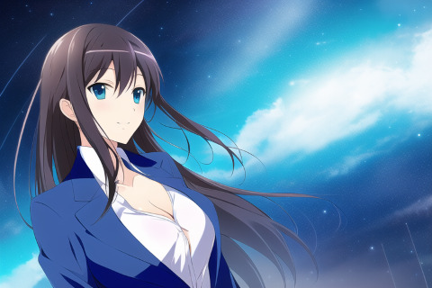

# 第二章 常规咒语

还能回想起施展魔法有哪些要素嘛？所需要的要素非常多，但是我们需要重点学习的只有咒语。正面咒语和反面咒语的可使用内容、使用技巧是完全相同的，前者发挥期望的效果，后者抑制不期望的效果。

### 观摩第一个魔法

<mark style="color:purple;">例2-1</mark> 请查看Prompt: `blue` 的连续4次施法。

图案出现了蓝色的天空、海洋。其中2次出现了女性人物形象。

<figure><figcaption></figcaption></figure>

 

<figure><figcaption></figcaption></figure>

 

<figure><figcaption></figcaption></figure>

 

<figure><figcaption></figcaption></figure>

你已经发现了NovelAI的第一大特色，就是可以轻松召唤美少女影像——即使你没有明确的表达这样的意图。

同时，这也说明了我们可以在咒语表述并不完整的前提下，给出一定的概念，由魔力自由发挥来完成魔法。

### 释放第一个魔法

我们还是从塑造美少的女形象开始学习和练习。

<mark style="color:purple;">例2-2</mark> 请输入Prompt: `1girl`

这是最常见并且基础的<mark style="background-color:blue;">0阶像素魔咒</mark>，作为像素魔法学习旅途的开始，最为合适不过了。由于随机性太大，就不展示法术效果了。

<mark style="background-color:blue;">0阶像素魔咒</mark>，在本书中简称<mark style="background-color:blue;">0阶魔咒</mark>。我们这样定义<mark style="background-color:blue;">0阶魔咒</mark>：单个魔咒即可产生稳定的法术效果。

类似地，我们定义<mark style="background-color:blue;">1阶魔咒</mark>：1个相关魔咒组合即可产生法术效果，但是法术效果不稳定。<mark style="background-color:blue;">2阶魔咒</mark>：2-3个相关魔咒组合即可产生稳定的法术效果。定义<mark style="background-color:blue;">3阶魔咒</mark>：3个或3个以上的相关魔咒组合才能产生法术效果；或者2个魔咒即可产生法术效果，但是效果不稳定。定义<mark style="background-color:blue;">4阶魔咒</mark>：多个不相关魔咒组合才能产生法术效果。定义魔咒的等级仅为方便对魔咒从复杂程度上进行分类和讨论，不代表魔咒本身的效果与威能。

一个完整的魔法，通常会有多组魔咒。

### 完善第一个魔法

刚才的魔法随机性非常强。每次释放几乎都是不同样子的女孩子——虽然从某种程度上讲这也不错。但是，如何输出一个确定的、心中所想的女孩子呢？那就是使用合适的魔咒进行恰当地组合。

<mark style="color:purple;">例2-3</mark> 请输入Prompt: `hatsune miku`

没错，“我超，初音未来！”。这个0阶魔咒非常稳定。但是只有极少数角色可以以这种方式实现。

<mark style="color:purple;">例2-4</mark> 请输入Prompt: `1girl, aqua hair, high twintail, white shirt, bare shoulders, black pleated skirt, black detached sleeves, aqua necktie, standing`

<figure><figcaption></figcaption></figure>

虽然不能说一模一样，但是可以称为颇为神似。这个魔法包含了哪些咒语呢？我们在1girl之后，跟随了：

1. aqua hair, high twintail, 2阶魔咒，指定了湖蓝色双马尾发型
2. white shirt, bare shoulders, 2阶魔咒，指定了漏肩衬衫
3. black pleated skirt, 0阶魔咒，指定了黑色百折裙
4. black detached sleeves, 0阶魔咒，黑色袖子
5. aqua necktie, 0阶魔咒，湖蓝色领带
6. standing，0阶魔咒，站立姿势

粗略来看，就是直接使用特定对象的特征词就结束了。那么哪些特征词是可以用的呢？可以查看[https://danbooru.donmai.us/](https://danbooru.donmai.us/) ，也有一些其他的参考书和工具可以使用。

你可能已经注意到，实际上的效果并非和描述完全一致。譬如使用了<mark style="color:orange;">black detached sleeves,黑色袖子</mark>，但是实际出现的是<mark style="color:orange;">白色袖子</mark>。并且多次重复施法也很难呈现理想效果（并非完全不能，而是概率极低）。这个例子说明，魔法并不总按照魔咒的堆砌而生效。

<mark style="color:purple;">例2-5</mark> 请输入Prompt: `1girl, aqua hair, high twintail, white shirt, bare shoulders, black pleated skirt, {{{{black detached sleeves}}}}, aqua necktie, standing, {{black arm wears}}`

在此例中，使用了两种技巧：

1. 使用了{}。{}的作用是加强魔咒的作用效果，任何魔咒都可以使用这个符号从而得到加强。可叠加使用，每对{}增强1.05倍。反之，使用\[]可以削弱效果。
2. 在末尾又增加了<mark style="color:orange;">black arm wears</mark>。它和前边的<mark style="color:orange;">black detached sleeves</mark>构成了2阶魔咒，对黑色袖子的概念进行强化。

但是很遗憾实际上并没有产生理想的效果（概率实际应有提升）。这个例子说明，并不一定因为个别魔咒有增强而产生决定性的效果。

<mark style="color:purple;">例2-6</mark> 请输入Prompt: `1girl, aqua hair, high twintail, {{{{black detached sleeves}}}}, white shirt, bare shoulders, black pleated skirt, aqua necktie, standing, {{black arm wears}}`

和前例相比，我们调整了black detached sleeves所在的位置。我们可以看到，此时出现黑色袖子的概率大大提升了——虽然还会有其他的问题。此例证明，魔咒的顺序会对结果造成很大影响，建议将最重要的内容保留在提示的前半部分。

当然也有一些其他的改善方法，比如提高魔力流转标尺 Scale，但是又会造成画风的变化；调高Steps，可能会增加额外的开销。

综合考虑，笔者认为使用白色袖子、其他方面更加自然的效果，是更好的。但是不同的人可能有不同的选择——你也可以使用更多的时间大量施法，从黑色袖子的图像中寻找各方面都完美的图片；或者使用其他技术手段对魔法效果进行补充。

### 第一个魔法：再进化

前例已经指定了人物形象和动作，但是通常我们需要再补充一些内容，构成故事性的效果。

<mark style="color:purple;">例2-7</mark> 请输入Prompt: `1girl, aqua hair, high twintail, white shirt, bare shoulders, black pleated skirt, {{{{black detached sleeves}}}}, aqua necktie, standing, {{black arm wears}}, stage, live, mic`

<figure><figcaption></figcaption></figure>

增加道具和场景（即麦克风和舞台）后，构成了舞台演出的画面。至此，我们的第一个魔法就完成了。
