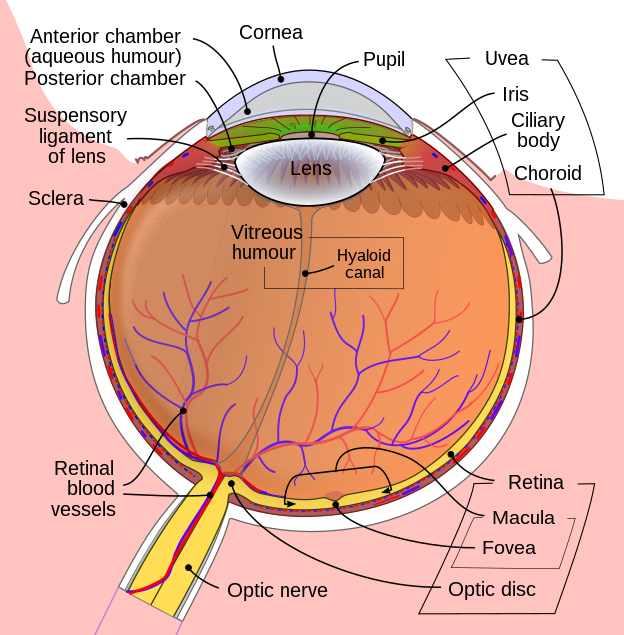

# 身体：面部

## 眼睛

通常使用颜色、瞳孔形状、动作几个方面控制眼睛。

### 眼睛颜色

具体的颜色可以参考头发，此处不再赘述。 眼睛有三个区域可以控制着色: 巩膜(眼白)sclera，瞳孔pupils, 虹膜(眼黑)eyes。但是实际上很难同时生效。

<figure><figcaption></figcaption></figure>

 

<figure><figcaption></figcaption></figure>

图片来自[维基百科](https://commons.wikimedia.org/wiki/File:Schematic\_diagram\_of\_the\_human\_eye\_zh-hans.svg)

特别的颜色有：

heterochromia 异色瞳（颜色不可控）以及multicolored eyes，后方跟随两个不同颜色的eye。

<mark style="color:purple;">例2-8</mark> 请输入Prompt: `multicolored eyes, blue eyes, green eyes`

<figure><figcaption></figcaption></figure>

### 瞳孔形状

大部分瞳孔形状的魔法成功率都不高

|           咒语          |  释义  |  备注  |
| :-------------------: | :--: | :--: |
|      slit pupils      |  竖瞳  |      |
| diamond-shaped pupils | 菱形瞳孔 | 1阶魔咒 |
|  flower-shaped pupils | 花形瞳孔 | 1阶魔咒 |
|  heart-shaped pupils  | 心形瞳孔 |      |
|   star-shaped pupils  |  星星眼 |      |

### 眼部动作、状态和其他

|          咒语          |          释义          |  备注 |
| :------------------: | :------------------: | :-: |
|       wide-eyed      |          睁大眼         |     |
|      closed eyes     |          闭眼          |     |
|       blinking       |          闭眼          |     |
|    one eye closed    |        一只眼睛闭上        |     |
|      missing eye     |   画面中缺一只眼（通常会用头发遮住）  |     |
|       one-eyed       |          独眼          |     |
|       eyepatch       |        眼罩（单眼）        |     |
|       blindfold      |       眼罩（两只眼睛）       |     |
|       third eye      |          三眼          |     |
|      empty eyes      |         空洞的眼睛        |     |
|    eye reflection    |         眼睛反光         |     |
|      glowing eye     |         发光的眼睛        |     |
|     flaming eyes     |        带火焰的眼睛        |     |
|       eyeliner       |          眼线          |     |
|       eyeshadow      |          眼影          |     |
|    bags under eyes   |          眼袋          |     |
|                      |                      |     |
|        jitome        | 眼睛顶部一条横线，无精打采或者冷漠、蔑视 |     |
|        tareme        |   下垂眼，眼角向下，仰视、柔弱的感觉  |     |
|        tsurime       |          上挑眼         |     |
| looking over eyewear |        扶眼镜的动作        |     |
|                      |                      |     |

## 其他五官

|       咒语      |    释义    |  备注 |
| :-----------: | :------: | :-: |
|    no nose    |   不绘制鼻子  |     |
|      lips     |    嘴唇    |     |
| puckered lips | 嘟嘴（准备接吻） |     |
|               |          |     |
|               |          |     |
|               |          |     |
|               |          |     |

## 表情

smiley face 笑容（通常露齿）

## 符号表情

在互联网初期，蓝星人发明了使用符号代表表情的技术。后来emoji和图片表情取代了符号表情。而现在，他又回来了。

通常符号表情用`:`和`;`指代正常的眼睛和眯着的眼睛。这里以含`:`的符号表情为例进行说明，不再赘述含`;`表情的效果。在novelAI中，大小写是被自动忽略的，因此在表格中使用更为象形的写法。 需要特别注意，以下表格中，部分符号表情可能会被字体引擎错误地渲染为emoji效果。

|  咒语 |     释义     |  备注  |
| :-: | :--------: | :--: |
|  :< |     哭脸     |  :(  |
|  :> |     笑脸     | 1阶魔咒 |
|  :) |     笑脸     |      |
|  :D |     大笑     |      |
|  :o |    惊讶张嘴    |      |
|  :p |     吐舌头    |      |
|  :q |    舔上嘴唇    |  无效  |
| >:) | 两个眉毛构成V的笑容 |      |
