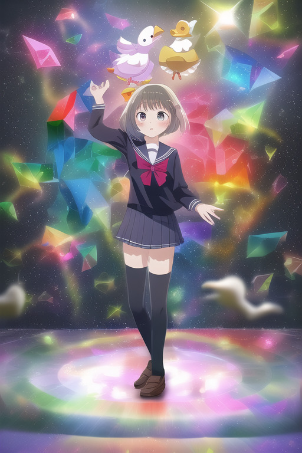

# 第六章 咒语的隐性效果

我们在设计魔法的时候，要有这样的概念：如非必要，勿增实体。

除非重复施法，都未能实现实现你需要的效果，否则应该尽量使用简短的咒语，一方面减少咒语之间的相互影响，另一方面尽可能让AI自然构建效果。过于冗长、冗长的咒语可能会产生背离期望的效果。

但是事实上，并非魔咒没有产生可以观测到的现象，就说明这个魔咒是没有生效的。我们在此再次强调，咒语是一种人类可以表达和使用的语言，但是咒语并非使用魔力的本质，而只是使用魔力的捷径。魔导器并不能理解你的语言，魔法也不是单纯把每个咒语的效果组合在一起。

魔法公鸡（magical cock）就是一个很好的例子。

<mark style="color:purple;">例6-1</mark> 魔法公鸡。请`设置Scale=5并`分别输入Prompt:&#x20;

`magical, 1girl, school uniform, prism, で召喚したイラストだ`

`magical cock, 1girl, school uniform, prism, で召喚したイラストだ`

`分别输出3次，效果如下：`

magical

<figure><figcaption></figcaption></figure>

 

<figure><figcaption></figcaption></figure>

 

<figure><figcaption></figcaption></figure>

`magical cock`

<figure><figcaption></figcaption></figure>

 

<figure><figcaption></figcaption></figure>

 

<figure><figcaption></figcaption></figure>

显然，使用magical cock的一组，画面更加融合。并且，大概率不会有鸡真的出现在画面中。

但是为什么cock能够发挥这样的作用呢？没有人能够解答。其他的动物能够产生相似效果吗？我们尝试了一些其他的动物，并没有产生相似效果。

<figure><figcaption>
magical fish
</figcaption></figure>

 

<figure><figcaption>
magical duck
</figcaption></figure>

 

<figure><figcaption>
magical cat
</figcaption></figure>

但是是不是只有鸟类才有效果呢？答案仍然是否定的。但是我们看到魔法凤凰（magical phoenix）产生了翅膀的效果。

<figure><figcaption>
magical chicken
</figcaption></figure>

 

<figure><figcaption>
magical phoenix
</figcaption></figure>

 

<figure><figcaption>
magical chicken, UC: chicken
</figcaption></figure>

目前还未发现其他的类似情况的咒语。
