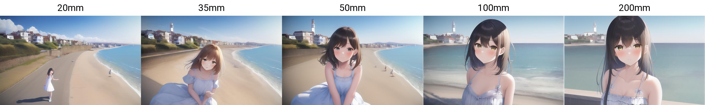
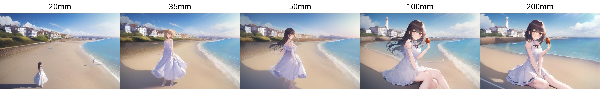

# 第七章 视角与构图

## 视角

`pov`即第一人称视角，使用第一人称视角的构图，人物的互动感更强。与之类似的`looking at viewer`人物单纯看向你（摄像机），不能和pov一样看到自己的肢体。另外，pov也很容易带来镜头畸变。

pov与incoming可以很好的构成二阶魔咒，例如：

|        咒语       |   释义  |  备注 |
| :-------------: | :---: | :-: |
| incoming attack |   来袭  |     |
|  incoming punch |  给你一拳 |     |
|   incoming hug  |  给你拥抱 |     |
|  incoming drink | 递过来饮料 |     |

再次强调，这需要与pov同时使用。另外注意一个特例：

|       咒语      |       释义      |   备注   |
| :-----------: | :-----------: | :----: |
| incoming hand |  实际效果是你向对方伸双手 | 需使用pov |
| reaching\_out | 对方伸出手（通常是一只手） | 不使用pov |

pov本身理论上也可以增强，但是实际效果不佳。例如：

|        咒语        |   释义   |  备注 |
| :--------------: | :----: | :-: |
|  pov across bed  |  在床上对视 |     |
| pov across table | 在桌对面对视 |     |

## 视线

|     咒语     |  释义 |  备注 |
| :--------: | :-: | :-: |
| from behind            | 相机从后方看      |      |
| looking back           | 人物看向后方      |      |
| facing back            | 转脸（但是不一定在看） |      |
| looking\_to\_the\_side | 看向侧面        | 1阶魔咒 |
|                        |             |      |
|                        |             |      |
|                        |             |      |
|                        |             |      |
|                        |             |      |
|                        |             |      |
|                        |             |      |

##

## 镜头取景

|         咒语        |      释义      |  备注 |
| :---------------: | :----------: | :-: |
|      panorama     | 全景（实际还是镜头崎变） |     |
|      fisheye      |      鱼眼      |     |
|     wide shot     |      广角      |     |
|   very wide shot  |      超广角     |     |
|      portrait     |   肖像（不包含肩膀）  |     |
|     upper body    |      上半身     |     |
|    cowboy shot    |     截至大腿     |     |
| feet out of frame |      截至脚     |     |
|     full body     |      全身      |     |
|     lower body    |      下半身     |     |
| head out of frame |      头出框     |     |
|    dutch angle    |   荷兰角，倾斜构图   |     |
|     from\_side    |      侧视      |     |
|      profile      |      侧脸      |     |
|     viewfinder    |   取景框（实际无效）  |     |
|    motion blur    |     运动模糊     |     |

另外，我们也可以直接指定镜头，如：`lens 135mm f1.8`

<figure><figcaption></figcaption></figure>

 

<figure><figcaption>
图片来自 <a href="https://seesaawiki.jp/nai_ch/d/%a5%ab%a5%e1%a5%e9%b8%fa%b2%cc">https://seesaawiki.jp/nai_ch/d/%a5%ab%a5%e1%a5%e9%b8%fa%b2%cc</a>
</figcaption></figure>

## 背景

|        咒语       |      释义      |       备注      |
| :-------------: | :----------: | :-----------: |
|   blue border   | 为画面添加指定色彩的边框 | 可以替换blue为其他颜色 |
| gradient border |     渐变色边框    | 实际是不可控颜色的渐变背景 |
|    cityscape    |      城市      |               |
|     scenery     |      风景      |               |
|      nature     |     自然环境     |               |
|    landscape    |  自然景观，通常有地平线 |               |

## 风格

|       咒语       |          释义         |  备注 |
| :------------: | :-----------------: | :-: |
|       ink      |          黑白         |     |
|    graphite    |        铅笔（石墨）       |     |
| colored pencil |       彩铅（效果一般）      |     |
|     lineart    |     单色线条（类似钢笔素描）    |     |
|     outline    | 实际效果类似lineart，有白线描边 |     |
|   mosaic art   |         马赛克         |     |
|    pixel art   |         像素风格        |     |
|  impressionism |      印象派（可能无效）      |     |
|   watercolor   |          水彩         |     |
| photorealistic |    写实风格，3d数字图像风格    |     |
|     sketch     |          速写         |     |
|     ukiyo-e    |         浮世绘         |     |
|    halftone    |          网点         |     |

艺术家的风格模仿列表参考 https://danbooru.donmai.us/wiki\_pages/list\_of\_style\_parodies

## 效果

|      咒语     |    释义    |  备注 |
| :---------: | :------: | :-: |
|  silhouette |    剪影    |     |
| drop shadow | 阴影（平行投影） |     |
|             |          |     |

## 光学效果

|            咒语           |          释义         |  备注 |
| :---------------------: | :-----------------: | :-: |
|       backlighting      |          逆光         |     |
|          bloom          |       有明亮的光线照射      |     |
|        lens flare       |         镜头光晕        |     |
|         sparkle         |          闪光         |     |
|    diffraction spikes   |         大闪光         |     |
| atmospheric perspective | 空气透视，实际效果是类似瑞利散射的天空 |     |

## 强调

把这一部分重点呈现（往往伴随了角色展示身体的这个部位的动作），而不是这里放大或者其他区域的虚化。

|        咒语        |  释义  |      备注     |
| :--------------: | :--: | :---------: |
|    male focus    | 强调男性 |             |
|    solo focus    | 强调一人 | 即使有多人也只凸现一人 |
|    navel focus   | 强调肚脐 |   隐含了露出肚脐眼  |
|   armpit focus   | 强调腋窝 |  伴随着抬起手臂的动作 |
|   weapon focus   | 强调武器 |  隐含了手持武器的前提 |
| wind chime focus | 强调风铃 |  通常会出现俯视视角  |
|                  |      |             |
